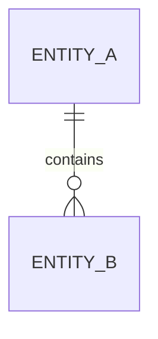

# Product Artifact Templates

Use only the template that matches the decision. Remove unused sections rather than filling them with ceremony.

## Product decision brief

```markdown
# Decision: [title]

Status: Proposed / Decided / Revisit
Owner: [name or role]
Decision date: [date]

## Recommendation
[Decision in plain language]

## Outcome and context
- Business outcome:
- Primary actor and job:
- Why now / cost of inaction:
- Hard constraints:

## Evidence ledger
| Claim | Fact/Observed/Inference/Assumption | Source | Confidence | Consequence if wrong |
|---|---|---|---|---|

## Options
| Option | Mechanism | Value | Cost/risk | Reversibility | Evidence |
|---|---|---|---|---|---|

## Trade-offs and non-goals

## Success, guardrails, and revisit triggers

## Next action
Owner / date / evidence threshold
```

## Product blueprint

```markdown
# Product Blueprint: [product/capability]

## 1. Executive decision
## 2. Business system
User, beneficiary, buyer, value, alternatives, capture, price/package, distribution, economics, strategic fit, operations

## 3. Problem and evidence
Segment, JTBD, current behavior, root causes, cost, evidence ledger

## 4. Outcome model
North-star outcome, product outcome, leading behavior, guardrails, baseline/target

## 5. Opportunity and assumptions
Opportunity map, critical assumptions, validation plan

## 6. Scope
In scope, non-goals, principles, rejected options

## 7. Experience
Entry, flows, decisions, states, recovery, content, permissions

## 8. Requirements
Traceable requirements and acceptance examples

## 9. System and data
Domain, ERD/schema, APIs/events, instrumentation, privacy/security, migration

## 10. Delivery and rollout
Slices, dependencies, decision rights, stakeholder commitments, roadmap, readiness, cohort, communication, rollback, support

## 11. Learning and governance
Decision dashboard, cadence, owners, stop/expand rules, decision log
```

## Lean PRD

```markdown
# PRD: [feature]

Decision/status/owner/date

## Problem
Actor, situation, evidence, current alternative, cost of inaction

## Outcome
Primary metric, baseline, target/range, guardrails

## Scope
In / out / principles / constraints

## Flow and states
Primary, alternate, empty, loading, error, success, permissions, recovery

## Requirements
| ID | Requirement/rule | Acceptance example | Evidence/source | Data/event |
|---|---|---|---|---|

## Data, security, privacy, analytics
## Dependencies and operations
## Validation and rollout
## Risks, assumptions, open questions, owners
```

## Experiment plan

```markdown
# Experiment: [name]

Decision informed:
Hypothesis and mechanism:
Population and assignment:
Control / variant:
Primary metric:
Guardrails:
Baseline / minimum worthwhile effect:
Sample / duration:
Data-quality checks:
Predefined thresholds:
Ship / iterate / stop rules:
Risks and exclusions:
Owner and review date:
```

## Commercial decision brief

```markdown
# Commercial Decision: [market / pricing / packaging / GTM / growth]

## Decision
Decision owner, deadline, recommendation, confidence, and revisit trigger

## Segment and roles
User, beneficiary, champion, buyer, approver, blocker, operator, renewal owner

## Value and alternatives
Current behavior/spend, measurable value, differentiated mechanism, switching friction

## Commercial system
Value metric, capture model, package, price range, route-to-market, onboarding/support/renewal

## Economics and sensitivity
| Variable | Base | Range/source | Decision sensitivity |
|---|---|---|---|

## Evidence and assumptions
Observed behavior, contracts, win/loss, tests, research, benchmarks with context

## Validation and rollout
Offer/test, population, threshold, guardrails, operational owner, migration/rollback
```

## Metric contract

```markdown
# Metric Contract: [name]

Decision use and owner:
Population / eligibility / exposure:
Numerator / denominator / deduplication:
Event time / timezone / window / late data:
Required segments and exclusions:
Source / lineage / freshness / data owner:
Quality checks and failure behavior:
Baseline / minimum worthwhile change / uncertainty:
Guardrails and related metrics:
Version and effective date:
```

## Experiment readout

```markdown
# Experiment Readout: [decision]

## Recommendation
Ship / iterate / continue / stop, confidence, owner, next review

## Design
Hypothesis, mechanism, population, assignment, exposure, variants, duration, stopping rule

## Integrity
Instrumentation, sample ratio, implementation, missingness, contamination, exclusions

## Results
| Metric | Control | Treatment | Absolute/relative effect | Interval | Threshold/guardrail |
|---|---|---|---|---|---|

## Interpretation
Practical significance, alternative explanations, pre-specified segments, limitations

## Decision and follow-up
Rollout/rollback, next evidence, owner, revisit trigger
```

## Stakeholder and decision plan

```markdown
# Alignment Plan: [decision or release]

Decision / deadline / final decider:
Non-decision and constraints:

| Stakeholder/role | Stakes/incentives | Authority | Position/evidence | Engagement/owner |
|---|---|---|---|---|

Decision model: DACI / RAPID / RACI for execution
Conflicts and resolution path:
Resource and policy commitments:
Operational owner and escalation:
Audience-specific communication:
Decision record and revisit trigger:
```

## Forecast and decision-outcome record

```markdown
# Forecast: [decision / claim]

Forecast ID / linked decision:
Claim and probability or interval:
Resolution rule / population / window:
Evidence, base rate, and assumptions:
Dependencies and alternative outcomes:
Allowed update rule:
Owner / resolution date:

## Resolution
Observed outcome and evidence:
Decision quality vs outcome quality:
Mechanism confirmed/refuted:
Main error source and surprises:
Calibration note / Brier score if binary:
Owned change to future practice:
```

## Release control contract

```markdown
# Release Control: [control ID]

Purpose / linked decision or risk:
Type / environments / affected services:
Default and dependency-failure behavior:
Eligibility / targeting / exclusions / precedence:
Exposure event and metric linkage:
Owner / change and stop authority:
Guardrails / alerts / audit record:
Created / review / expiry / removal owner:
```

## Data design

```markdown
# Data Design: [domain]

Engine/scale/tenancy/consistency/retention assumptions

## Domain and lifecycle
Entities, invariants, states, commands, events, permissions

## ER diagram


## Schema and constraints
## Access patterns and indexes
## API/event/data contracts
## Analytics plan
## Privacy/security/audit/retention
## Migration/backfill/validation/rollback
## Risks and unresolved decisions
```

## Traceability matrix

| Outcome | Opportunity | Capability | Requirement | Flow/state | Entity/event | Metric | Release slice |
|---|---|---|---|---|---|---|---|

Use this matrix to detect orphan features, unmeasured requirements, missing data, and implementation work that serves no declared outcome.
